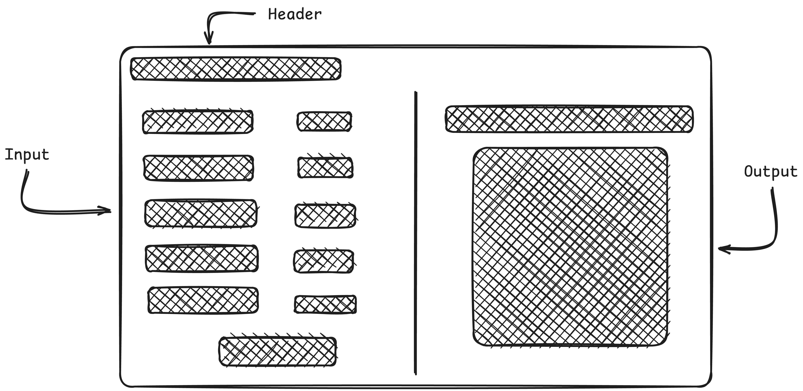

**Team Name**: Fluffy Llama \
**Team Members**: Adan Alter, Corban Pendrak, Timmy Loos

</img>

## What problem are we trying to solve?
Create an easy method to search the U.S. Department of Health & Human Services Nutritional Dataset by relevant divisions.

## Why is this a problem?
This dataset is important for understanding the general understanding of nutrition across the United States, but without clear divisions, it is unintuitive to understand.

## When do we know that we have solved the problem?
A UI should be created that allows for a seamless display of the dataset for simple analysis.

## What are we analyzing?
We use the U.S. Department of Health & Human Services Nutritional Dataset.

## What are we using?

- Catch
- C++20
- SFML

## What should it look like?

## How are we going to do this?
Preliminary algorithms or data structures we may want to implement and how we represent the data.
- Concurrent vs nonconcerrent
- Merge vs quick vs heap sort vs sleep sort
- Load data using selected algorithm into objects and sort by question and state

## Who is going to do what?

- Design program flow: **All**
- Design abstract base class: **Corban**
- Create main method: **All**
- Create merge sort: **Adan**
- Create quick sort: **Corban**
- Create heap sort: **Timmy**
- Create sleep sort: **Corban**
- Create UI: **All**
- Connect UI to methods: **All**

## Code Flow

Here are the steps for programming. Please follow them to ensure consistent code across the repository.
1. Check responsibilities for problem to solve
2. Track steps with Tasks below
3. Write your code with documentation
   1. Use git branches to separate and test algorithms
   2. Document function/class **purpose**, **input**, and **output**
   3. Document **confusing lines of code**
   4. Commit frequently at breaks to save code
   5. Use "If added, this commit will {Your commit}" format
4. Test your code
   1. Write a Catch test in `/tests`
   2. Check code coverage
5. Merge your code into the `master` branch

## Tasks

- [x] Create GitHub repository @CorbanPendrak
  - [x] Document repository @CorbanPendrak
  - [x] Style repository @CorbanPendrak
  - [x] Describe code flow
  - [x] Welcome comments
- [ ] Setup Dependencies
  - [x] Setup SFML @CorbanPendrak
  - [ ] Precommit hook to reformat code
  - [x] Setup Catch
  - [x] Create SFML Catch test
  - [ ] Setup code coverage
- [ ] Program flow design
- [x] Create progress bar GUI element